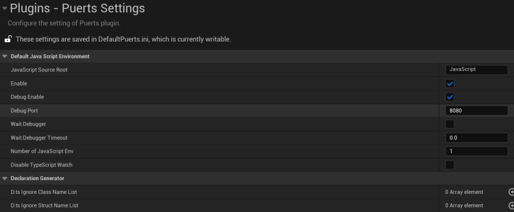

## Debugging with VSCode

Below is a translated version of the original docs by Incanta Games. The translation is mainly done with Google Translate, but then modified by hand to try to make sense of what Google Translate is missing.

### Automatic binding mode debug configuration

- In the main menu, select `Edit -> Project Settings`, enable the `Debug Enable` setting under the `Plugin -> Puerts Setting` page.



- Enable `Wait Debugger` in the settings above if you want to the JS to wait for a debugger to attach before executing any code
    - Even if you launch VSCode with the debugger to attach ASAP, it may take at least 100ms for the debugger connection handshake to finish.
    - If you don't have this setting enabled, JS scripts will execute immediately, making it possible for you to not hit a breakpoint because the debugger couldn't attach in time. Enabling this setting will tell Puerts to wait for a debugger to attach before executing any JS code, allowing you to not miss anything.

### Since create a virtual machine mode, debug configuration

Incanta here. I'm not quite sure what this section is really for. It sounds like there may be some extra work for virtual machines? Most of this code is already embed in `PuertsModule.cpp`, which I believe is the "automatic binding mode" mentioned above. I'm not really sure what this mode is.

- Create a `FJsEnv` incoming debug port

``` cpp
// 8080 Debug port
GameScript = MakeShared<puerts::FJsEnv>(
  std::make_unique<puerts::DefaultJSModuleLoader>(TEXT("JavaScript")),
  std::make_shared<puerts::FDefaultLogger>(), 8080
);
```

- Blocking waiting debugger link

``` cpp
GameScript = MakeShared<puerts::FJsEnv>(
  std::make_unique<puerts::DefaultJSModuleLoader>(TEXT("JavaScript")),
  std::make_shared<puerts::FDefaultLogger>(), 8080
);
GameScript->WaitDebugger();

//...

GameScript->Start("QuickStart", Arguments);
```

### VSCode and UE editor precautions

#### Auto Attaching a Debugger

Like any other JavaScript project, you can configure VSCode to automatically attach a debugger when it detects a process with inspector is running. There's nothing really different here, but here's the translation anyway:

Open User Settings in VSCode, search for `Auto Attach`, set `Debug` > `Node Auto Attach` to `On`

In more recent versions of VSCOde, you may have to configure two different settings `Auto Attach Filter` and `Auto Attach Smart Filter` to get it to work. You're also welcome to specify in your `launch.json` to attach a debugger to a specific port.

#### Slow Debugger Performance

By default, Unreal comes with `Use Less CPU when in Background` enabled. This slows a lot of functions of the editor down when you're focused on something other than Unreal Engine. The gain here is that you're not running full rendering cycles when you're opening other programs like Blender, Maya, Substance Painter, etc. and slowing your computer for no reason.

However, when you're running the debugger in VSCode and focused on VSCode instead of the engine, things will run very slowly (like 4 FPS instead of 30-120 FPS). You can enable this setting while you're debugging to ensure the game is still running at full speed while you're stepping through your JS/TS code.

You can find this setting in `Editor Preferences` under `General > Performance`.
