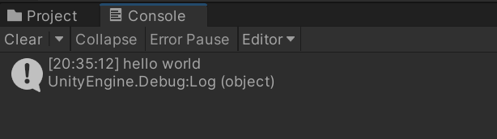

# 开始PuerTS之旅
首先，请跟随[安装指引](../install.md)将PuerTS装入你的Unity项目

------------

然后，在Unity里准备好一个场景及一个MonoBehaviour组件，在MonoBehaviour里编写如下代码：
```csharp
//1. Hello World
void Start() {
    Puerts.JsEnv env = new Puerts.JsEnv();
    env.Eval(@"
        console.log('hello world');
    ")
}
```
执行后，你能看见Unity控制台中打印出了`Hello world`。



成功了！

这就意味着，我们在Unity里执行了一段真正的Javascript！

PuerTS就是这么容易！

------------

在PuerTS的帮助下，Javascript和C#的打通还可以更精彩，请往下看