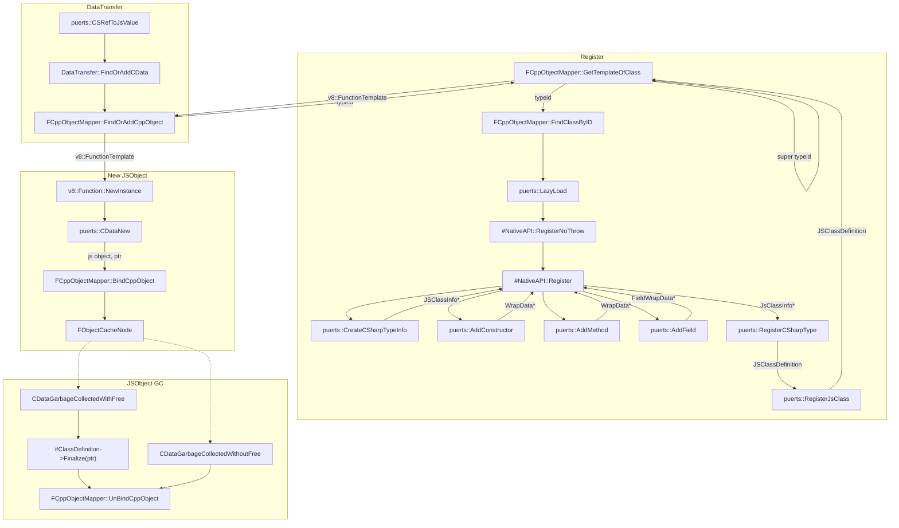

# Puerts Il2cpp

## Flowchart

```mermaid
graph TD
	subgraph Register
		direction LR
		FCppObjectMapper::GetTemplateOfClass --> |super typeid|FCppObjectMapper::GetTemplateOfClass
		FCppObjectMapper::GetTemplateOfClass --> |typeid|FCppObjectMapper::FindClassByID --> puerts::LazyLoad --> #NativeAPI::RegisterNoThrow
		#NativeAPI::RegisterNoThrow -->
		#NativeAPI::Register --> puerts::CreateCSharpTypeInfo
		#NativeAPI::Register --> puerts::AddConstructor
		#NativeAPI::Register --> puerts::AddMethod
		#NativeAPI::Register --> puerts::AddField
		puerts::AddConstructor --> |WrapData*| #NativeAPI::Register
		puerts::AddMethod --> |WrapData*| #NativeAPI::Register
		puerts::CreateCSharpTypeInfo --> |JSClassInfo*| #NativeAPI::Register 
		puerts::AddField --> |FieldWrapData*| #NativeAPI::Register 
		#NativeAPI::Register --> |JsClassInfo*|puerts::RegisterCSharpType --> |JSClassDefinition|puerts::RegisterJsClass
		puerts::RegisterJsClass --> |JSClassDefinition|FCppObjectMapper::GetTemplateOfClass
	end
	subgraph DataTransfer
    	puerts::CSRefToJsValue --> DataTransfer::FindOrAddCData --> FCppObjectMapper::FindOrAddCppObject --> |typeid|FCppObjectMapper::GetTemplateOfClass
		FCppObjectMapper::GetTemplateOfClass --> |v8::FunctionTemplate|FCppObjectMapper::FindOrAddCppObject
	end
	subgraph New JSObject
	FCppObjectMapper::FindOrAddCppObject --> |v8::FunctionTemplate|v8::Function::NewInstance --> puerts::CDataNew --> |js object, ptr|FCppObjectMapper::BindCppObject --> FObjectCacheNode
	end
	subgraph JSObject GC
		FObjectCacheNode -.-> CDataGarbageCollectedWithFree --> FinializePtr["#ClassDefinition->Finalize(ptr)"] --> FCppObjectMapper::UnBindCppObject
		FObjectCacheNode -.-> CDataGarbageCollectedWithoutFree --> FCppObjectMapper::UnBindCppObject
	end
```