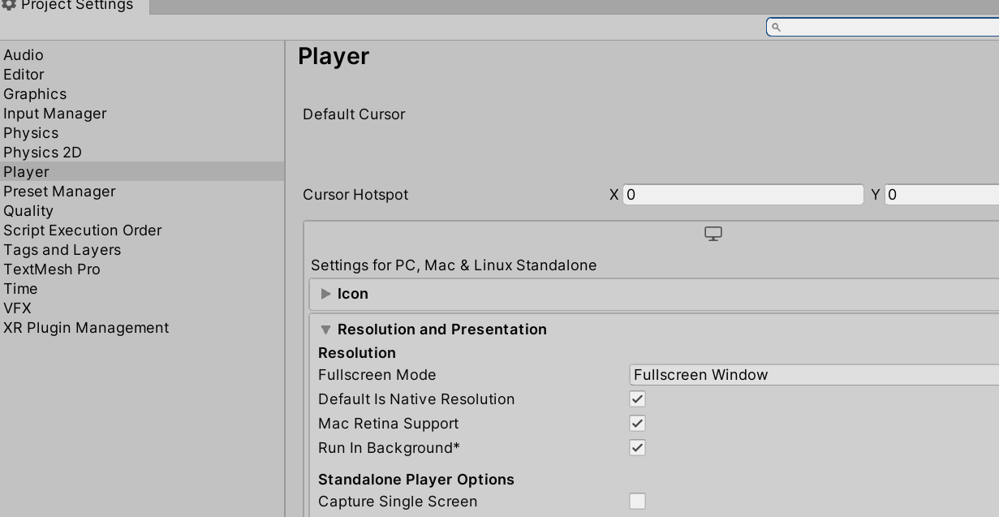

# VSCode Debug 指引

这里推荐你使用vscode进行debug。但如果是手机debug的时候，推荐你参考[开发blog](https://zhuanlan.zhihu.com/p/359598262)

* new JsEnv之后，需要传入debug端口。且在合适的地方调用jsEnv的Tick函数

```csharp
//8080是连接的端口，和vscode工程目录下的.vscode\launch.json保持一致
void Start()
{
    jsEnv = new JsEnv(new TSLoader(), 8080); // 推荐使用TSLoader，就不需要你手动指定JS输出目录
    jsEnv = new JsEnv(new DefaultLoader("F:/puerts/unity/TsProj/output/"), 8080); // 使用DefaultLoader时需要手动指定你的JS输出目录。
}

void Update()
{
    jsEnv.Tick();
}
```

* 等待调试器链接
  - 调试器通过websocket连接，期间有TCP的握手，websocket握手，建立连接后，调试器和V8还会交换些信息，整个过程大概几百毫秒
  - 在这几百毫秒内执行的脚本将无法断点，如果你想断点这些代码，可以用puerts的等待调试器连接功能
  - 如果c#版本高于7.2（支持async），建议用异步等待，否则用同步阻塞等待
  
  
## 异步等待例子 

```csharp
async void RunScript()
{
    jsEnv = new JsEnv(new DefaultLoader("E:/puerts_unity_demo/TsProj/output/"), 8080);
    await jsEnv.WaitDebuggerAsync();
    jsEnv.ExecuteModule("QuickStart.mjs");
}

void Start()
{
    RunScript();
}

void Update()
{
    jsEnv.Tick();
}
```

** 同步阻塞例子

```csharp
void Start()
{
    jsEnv = new JsEnv(new DefaultLoader("E:/puerts_unity_demo/TsProj/output/"), 8080);
    jsEnv.WaitDebugger();
    jsEnv.ExecuteModule("QuickStart.mjs");
}

void Update()
{
    jsEnv.Tick();
}
```

* vscode下打开setting，搜索auto attach，将Debug>Node:Auto Attach设置为“on”（高版本vscode没有该选项，可以不设置）。
* 或是自行创建vscode debug的launch.json，将其端口号配置改为你上面设置的端口号：选择node.js attach


* 打开“ProjectSetting/Player”页面，把“Run In Background”勾选上


