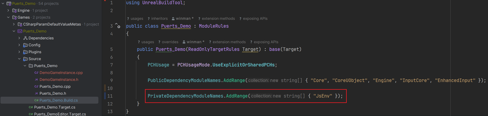

# Template-Based Static Binding
Unreal has a lot of C++ functions and classes without reflection tags. In order to access them within TypeScript, Template-based static binding should be used.

## Table Of Contents
- [Setup](#setup)
- [Usage](#usage)
    - [Unreal Engine Classes](#unreal-engine-class)
    - [Regular C++ Classes](#regular-c-class)
- [API Reference](#api-reference)
    - [Function Decaleration](#function-decaleration)
    - [Function Referencing](#function-referencing)
    - [Variable Decaleration](#variable-deceleration)
    - [Variable Referencing](#variable-referencing)
    - [Constructor Decaleration](#constructor-deceleration)
    - [Inheritence](#inheritance)

## Setup
In order for C++ to register puerts modules, dependencies must be added to the `*.Build.cs` file. 

For template based static binding, `JsEnv` is required.



## Usage
### Unreal Engine Class
##### C++
``` c++
// UObject_Bindings.h
#pragma once

#include "Binding.hpp"
#include "UEDataBinding.hpp"

// Define all used types
UsingUClass(UObject)
UsingUClass(UWorld)
UsingUClass(UClass)

class UObject_Bindings
{
public:
	UObject_Bindings()
	{
		puerts::DefineClass<UObject>()
			.Method("GetWorld", MakeFunction(&UObject::GetWorld))
			.Method("GetClass", MakeFunction(&UObject::GetClass))
			.Method("IsValid", MakeFunction(&UObject::IsValidLowLevel))
			.Register();
	}
};

inline UObject_Bindings UObject_Bindings_Registrar;
```
##### TypeScript
``` typescript
if (MyUObj?.IsValid())
{
    const World = MyUObj?.GetWorld();
    const ObjectClass = MyUObj?.GetClass();
}
```

### Regular C++ Class
##### C++
``` cpp
// ExampleClass.h
#pragma once

class ExampleClass
{
// Static
public:
    static int StaticAdd(int a, int b)
    {
        return a + b;
    }

    inline static int StaticInt{30035};

// Non-Static
public:
    int GetRegularInt()
	{
		return RegularInt;
	}

    int RegularInt{1337};
};
```
``` c++
// ExampleClass_Bindings.h
#pragma once

#include "Binding.hpp"
#include "ExampleClass.h"

// Define all used types
UsingCppType(ExampleClass);

class ExampleClass_Bindings
{
public:
    ExampleClass_Bindings()
    {
        puerts::DefineClass<ExampleClass>()
            .Function("StaticAdd", MakeFunction(&ExampleClass::StaticAdd))          // Static Function
            .Variable("StaticInt", MakeVariable(&ExampleClass::StaticInt))          // Static Variable
            .Method("GetRegularInt", MakeFunction(&ExampleClass::GetRegularInt))    // Member Function
            .Property("RegularInt", MakeProperty(&ExampleClass::RegularInt))        // Member Variable
            .Register();
    }
};

inline ExampleClass_Bindings ExampleClass_Bindings_Registrar;
```
##### TypeScript
``` typescript
import * as Cpp from 'cpp'

console.log("Static Int = " + Cpp.ExampleClass.StaticInt);

const AddedResult = Cpp.ExampleClass.StaticAdd(12, 34);
console.log("StaticAdd(12, 34) = " + AddedResult);

const ExampleClass = new Cpp.ExampleClass();
console.log("GetRegularInt() = " + ExampleClass?.GetRegularInt());
console.log("RegularInt = " + ExampleClass?.RegularInt);
```

**Note: After defining a classes bindings, compile the C++, restart Unreal Engine and regenerate TypeScript definitions**

## API Reference

### Function Decaleration
| Function | Description |
| -------- | ----------- |
| `.Method(Name, Function Reference)` | Exposes a member function to TypeScript |
| `.Function(Name, Function Reference)` | Exposes a static function to TypeScript |

### Function Referencing
| Function | Description |
| -------- | ----------- |
| `MakeFunction(Reference To Function)` | Creates a member function reference |
| `MakeCheckFunction(Reference To Function)` | Creates a member function reference with parameter varification |
| `SelectFunction(ReturnType... (ClassName::*)(Parameters...), Reference To Function)` | Creates a member function reference based on a single function overload |

If the function has multiple overloads:
##### C++
``` c++
CombineOverloads(
    MakeOverload(void (ExampleClass::*)(), &ExampleClass::ExampleFunction),
    // More Overloads...
    )
```

### Variable Deceleration
| Function | Description |
| -------- | ----------- |
| `.Property(Name, Variable Reference)` | Exposes a member variable to TypeScript |
| `.Variable(Name, Variable Reference)` | Exposes a static variable to TypeScript |

### Variable Referencing
| Function | Description |
| -------- | ----------- |
| `MakeProperty(Reference To Variable)` | Creates a member variable reference |
| `MakePropertyByGetterSetter(&ClassName::GetterFunction, &ClassName::SetterFunction)` | Creates a member variable reference proxied through getter and setter functions |
| `MakeVariable(Reference To Variable)` | Creates a static variable reference |

### Constructor Deceleration
| Function | Description |
| -------- | ----------- |
| `.Constructor()` | Exposes the default constructor to TypeScript |
| `.Constructor<Arg1Type, Arg2Type, ...>()` | Exposes a specified constructor with arguments to TypeScript |

If the constructor has multiple overloads:

##### C++
``` cpp
.Constructor(
    CombineConstructors(
        MakeConstructor(ExampleClass),
        MakeConstructor(ExampleClass, int),
        // More overloads...
    ))
```

### Inheritance
##### C++
``` cpp
// ExampleBaseClass.h
#pragma once

class ExampleBaseClass
{
public:
    virtual int VirtualMemberFunction()
    {
        return -1;
    }
};
```
``` c++
// ExampleBaseClass_Bindings.h
#pragma once

#include "Binding.hpp"
#include "ExampleBaseClass.h"

UsingCppType(ExampleBaseClass);

class ExampleBaseClass_Bindings
{
public:
    ExampleBaseClass_Bindings()
    {
        puerts::DefineClass<ExampleBaseClass>()
            .Method("VirtualMemberFunction", MakeFunction(&ExampleBaseClass::VirtualMemberFunction))
            .Register();
    }
};

inline ExampleBaseClass_Bindings ExampleBaseClass_Bindings_Registrar;
```
``` cpp
// ExampleChildClass.h
#pragma once

#include "ExampleBaseClass.h"

class ExampleChildClass : public ExampleBaseClass
{
public:
    virtual int VirtualMemberFunction() override
    {
        // Overrided Implementation
        return 1337;
    }
};
```
``` c++
// ExampleChildClass_Bindings.h
#pragma once

#include "Binding.hpp"
#include "ExampleChildClass.h"

UsingCppType(ExampleChildClass);

class ExampleChildClass_Bindings
{
public:
    ExampleChildClass_Bindings()
    {
        puerts::DefineClass<ExampleChildClass>()
            .Extends<ExampleBaseClass>()
            .Register();
    }
};

inline ExampleChildClass_Bindings ExampleChildClass_Bindings_Registrar;
```