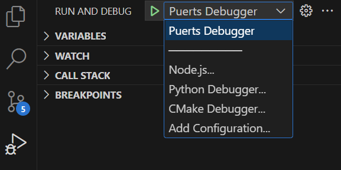

# Debugging
## Table Of Contents
- [Automatic Binding Mode](#automatic-binding-mode)
- [Starting A New JavaScript Virtual Machine](#starting-a-new-javascript-virtual-machine)
- [Intergrating With VSCode](#intergrating-with-vscode)
- [Notes](#notes)

## Automatic binding mode
To enable debugging for automatic binding mode, its as simple as turning it on inside of the project settings.

1. Open the project settings `Edit -> Project Settings`
2. Navigate to Puerts settings `Plugins -> Puerts Settings`
3. Enabled `Debug Enable`
4. Configure the `Debug Port` (Optional)


## Starting A New JavaScript Virtual Machine
Upon creating an instance of FJSEnv, there are a couple of extra parameters we can specify to start the virtual machine in debug mode.

##### C++
``` c++
auto JsEnv = MakeShared<puerts::FJsEnv>(
  std::make_unique<puerts::DefaultJSModuleLoader>(TEXT("JavaScript")), // Specifies the default script location (Default: "Content/JavaScript")
  std::make_shared<puerts::FDefaultLogger>(), // A logger object to catch console.log
  8080 // The port to start the debugger on (i.e. Attach to this with VSCode)
);

// Start the JavaScript virtual environment
JsEnv->Start(/*...*/);
```

## Intergrating with VSCode
To debug puerts code with VSCode, a `launch.json` file needs to be created inside of your project root directory. (`YourProject/launch.json`)

##### Example launch.json
```json
{
    "configurations": [
    {
        "type": "node",
        "name": "Puerts Debugger",
        "port": 8080,
        "request": "attach",
    }]
}
```

After creating this file, start your PuerTS code and attach the `Puerts Debugger` inside of VSCode. You should now be able to place brakepoints, examine variables, e.t.c.



**Note: If you do not [wait for the debugger](#waiting-for-debugger-attachment), breakpoints will be skipped prior to attachment.**

## Notes
###  Table Of Contents
- [Waiting For Debugger Attachment](#waiting-for-debugger-attachment)
- [Slow Debugger Performance](#slow-debugger-performance)

### Waiting For Debugger Attachment
If you wish for your debugger (i.e. VSCode) to hit breakpoints on code that happens upon entering the JavaScript virtual environment, you will need to wait for your debugger to attach.

#### Automatic Binding Mode
If you wish to wait for the debugger to attach during automatic binding mode, simply enable `Wait Debugger` in the project settings.

1. Open the project settings `Edit -> Project Settings`
2. Navigate to Puerts settings `Plugins -> Puerts Settings`
3. Enabled `Wait Debugger`
4. Configure the `Wait Debugger Timeout` (Optional)

#### Starting A New JavaScript Virtual Machine
If you wish to wait for the debugger to attach on manually started virtual machines, simply call `WaitDebugger` before starting your JavaScirpt environment.

``` c++
auto JsEnv = MakeShared<puerts::FJsEnv>(
  std::make_unique<puerts::DefaultJSModuleLoader>(TEXT("JavaScript")),
  std::make_shared<puerts::FDefaultLogger>(),
  8080 // The port to start the debugger on (i.e. Attach to this with VSCode)
);

// Call this function to wait for the debugger to attach!
JsEnv->WaitDebugger(100); // Stop waiting after 100ms (Optional)

JsEnv->Start(/*...*/);
```
**Note: A timeout in milliseconds may be passed in as an argument to `WaitDebugger` if nothing attaches.**

### Slow Debugger Performance
By default, Unreal comes with `Use Less CPU when in Background` enabled. This slows down the editor when you're focused on something other than Unreal Engine. The gain here is that you're not running full rendering cycles when you're tabbed out however, when you're running the debugger in VSCode and focused on VSCode instead of the engine, things will run very slowly (i.e. 4 FPS). As such, it is reccomended to disable this function whilst debugging to ensure the game is still running at full speed while you're stepping through the JavaScript code.

1. Open the editor preferences settings `Editor Preferences`
2. Navigate to the performance settings `General -> Performance`
3. Disable `Use Less CPU when in Background`
