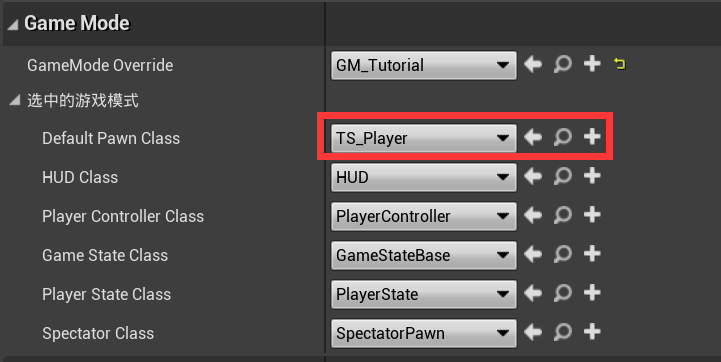

## 继承引擎类功能

开启该功能后能做到特定写法的类能被UE编辑器识别

* 命令行进入Plugins/Puerts目录，执行如下命令即可完成该模式的开启和依赖安装

~~~shell
node enable_puerts_module.js
~~~

例如这么一个类：

~~~typescript
import * as UE from 'ue'

class TS_Player extends UE.Character {
}

export default TS_Player;
~~~

然后你在UE编辑器就能选择它

* 能被UE识别的类，支持构造函数，支持override蓝图能override的方法，支持轴映射Axis、Action事件，支持RPC

~~~typescript
class TS_Player extends UE.Character {
    FpsCamera: UE.CameraComponent;
    //...

    Constructor() {
        let FpsCamera = this.CreateDefaultSubobjectGeneric<UE.CameraComponent>("FpsCamera", UE.CameraComponent.StaticClass());
        FpsCamera.SetupAttachment(this.CapsuleComponent, "FpsCamera");
        //...
    }

    MoveForward(axisValue: number): void {
        this.AddMovementInput(this.GetActorForwardVector(), axisValue, false);
    }

    MoveRight(axisValue: number): void {
        this.AddMovementInput(this.GetActorRightVector(), axisValue, false);
    }

    ReceiveBeginPlay(): void {
        //...
    }

~~~

### 格式

一个TypeScript满足如下以下三点，一个类才能被UE编辑器识别

* 这个类继承自UE的类或者另一继承UE的类；
* 类名和去掉.ts后缀的文件名相同；
* 把这个类export default。

### 限制

* 不支持继承蓝图，只支持继承原生类
* 继承UserWidget或其子类并不能编辑

### 相关命令行

在UE命令行输入命令，可以查阅内部状态，手动触发特定typescript文件的编译

* `puerts ls [pattern]`：查询纳入增量编译的文件，pattern是可选参数，支持正则表达式，不输入该参数标识所有文件。例子：
    -  `puerts ls`
    -  `puerts ls TsTestActor`
* `puerts compile id`，其中id是`puerts ls`返回的id，例子：
    - `puerts compile e9050088932a23f720713a9a5073986e`

### 生命周期

本模式下，继承UE类型的TypeScript类型的对象，生命周期由引擎管理。

比如下面这个例子：

~~~typescript
let obj = getsomeobject();
setTimeout(() => {
    console.log(obj.XXX);
}, 1000);
~~~

obj对象通过闭包被引用了，如果这个obj是个普通UE对象，puerts会对obj加个强引用，如果是继承UE类型的TypeScript类型的对象，则不加引用。

### 构造函数

和标准的typescript构造函数不一样，继承引擎类模式被UE初始化调用的构造函数首字母需大写，也就是Constructor

~~~typescript
class TsTestActor extends UE.Actor {
    tickCount: number;

    //注意，继承UE类的js类，构造函数必须大写开头
    Constructor() {
        this.PrimaryActorTick.bCanEverTick = true;
        tickCount = 0;
    }
}
~~~

* 构造函数中可以调用一些UE限定必须在构造函数调用的API，比如CreateDefaultSubobject
* 如果一个类定义了构造函数，该类成员变量的初始化会被TypeScript接管，这时你在UE编辑器下设置的值将会无效
* 如果没定义构造函数，则支持在UE编辑器手动设置成员变量值
* Constructor是UE调用的构造函数，只用作UE成员的初始化
  - 不能在该函数中做js的初始化工作，比如no-blueprint标注的变量的初始化
  - 不能在该函数中申请js的资源，比如创建一个闭包函数，因为重载虚拟机后这些资源将失效，然而构造函数不会重新执行
* 目前不支持在一个Actor的构造函数修改Component的属性，因为SpawnActor在构造完对象后，有个对Component的重置: [构造函数设置Component属性无效](https://github.com/Tencent/puerts/issues/287)
* 开启AsyncLoadingThreadEnabled后，Constructor中不能调用CreateDefaultSubobject，否则Constructor延迟调用后，CreateDefaultSubobject会因为不再构造时机调用而报错

### 继承引擎类模式支持的数据类型

只有用继承引擎类模式支持的类型声明的字段、方法，才能被UE识别

**直接映射的类型**

void，number，string，bigint，boolean，UE模块下的UObject派生类、枚举、UStruct，TArray、TSet、TMap、TSubclassOf（类引用）、TSoftObjectPtr（软对象引用）、TSoftClassPtr（软类引用）

注意：一个函数返回类型声明为void才是无返回值，如果一个函数不声明返回类型，等同于返回any类型，而自动半丁模式并不支持any类型

如下是几个字段和方法的示例：

~~~typescript
class TsTestActor extends UE.Actor {
    tickCount: number;

    actor: UE.Actor; 

    map: UE.TMap<string, number>;

    arr: UE.TArray<UE.Object>;

    set: UE.TSet<string>;

    Add(a: number, b: number): number {
        return a + b;
    }
    
    e: UE.ETickingGroup;
    
    clsOfWidget: UE.TSubclassOf<UE.Widget>;

    softObject: UE.TSoftObjectPtr<UE.Actor>;

    softClass: UE.TSoftClassPtr<UE.Actor>;
}
~~~

**类型注解**

TypeScript和UE两者间的数据类型丰富程度不一样，因而两者并不是一一映射的，比如UE里头的byte，int，float都对应TypeScript的number，那么我们如何告诉puerts生成我们所需的类型呢？puerts提供了类型注解，如下是几个例子：

~~~typescript
class TsTestActor extends UE.Actor {
    //@cpp:text
    Foo(): string {
        return "hello";
    }

    Bar(p1:number/*@cpp:int*/): void {
    }

    //@cpp:name
    Field: string;
}
~~~

* Foo的返回值是FText
* Bar的参数是int
* Field字段的类型是FName
* 目前支持的类型注解支持的类型有：text，name，int，byte

### 其它注解

除了类型注解，puerts还支持其它注解

* @no-blueprint

表示不被UE编辑器识别，方法和字段均可用

~~~typescript
class TsTestActor extends UE.Actor {
    //@no-blueprint
    TsOnlyMethod():void {

    }

    //@no-blueprint
    TsOnlyField: number;
}
~~~

### rpc

可以通过decorator来设置方法、字段的RPC属性。

注意：TypeScript的decorator默认不打开，需要在tsconfig.json上将experimentalDecorators属性设置为true

* rpc.flags

为字段，方法设置flags

* rpc.condition

为字段设置replicate condition

~~~typescript
class TsTestActor extends UE.Actor {
    @rpc.flags(rpc.PropertyFlags.CPF_Net | rpc.PropertyFlags.CPF_RepNotify)
    @rpc.condition(rpc.ELifetimeCondition.COND_InitialOrOwner)
    dint: number;

    @rpc.flags(rpc.FunctionFlags.FUNC_Net | rpc.FunctionFlags.FUNC_NetClient)
    Fire(): void {

    }

    @rpc.flags(rpc.FunctionFlags.FUNC_Net | rpc.FunctionFlags.FUNC_NetServer | rpc.FunctionFlags.FUNC_NetReliable)
    FireServer(): void {

    }

    //如果字段设置了CPF_RepNotify，需要增加“OnRep_字段名”为名字的方法
    OnRep_dint(): void {
        
    }
}
~~~
