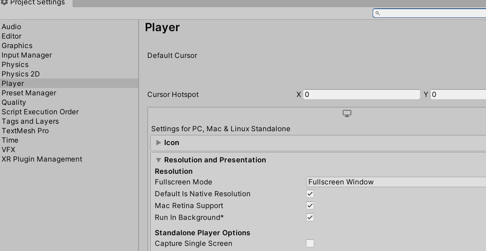

## vscode debug指引

* new JsEnv的时候，需要按如下示例输入端口及vscode工程的js输出目录，并且在合适的地方调用jsEnv的Tick函数

```csharp
//8080是连接的端口，和vscode工程目录下的.vscode\launch.json保持一致
void Start()
{
    jsEnv = new JsEnv(new DefaultLoader("F:/puerts/unity/TsProj/output/"), 8080);
}

void Update()
{
    jsEnv.Tick();
}
```

* vscode下打开setting，搜索auto attach，将Debug>Node:Auto Attach设置为“on”


* 打开“ProjectSetting/Player”页面，把“Run In Background”勾选上

